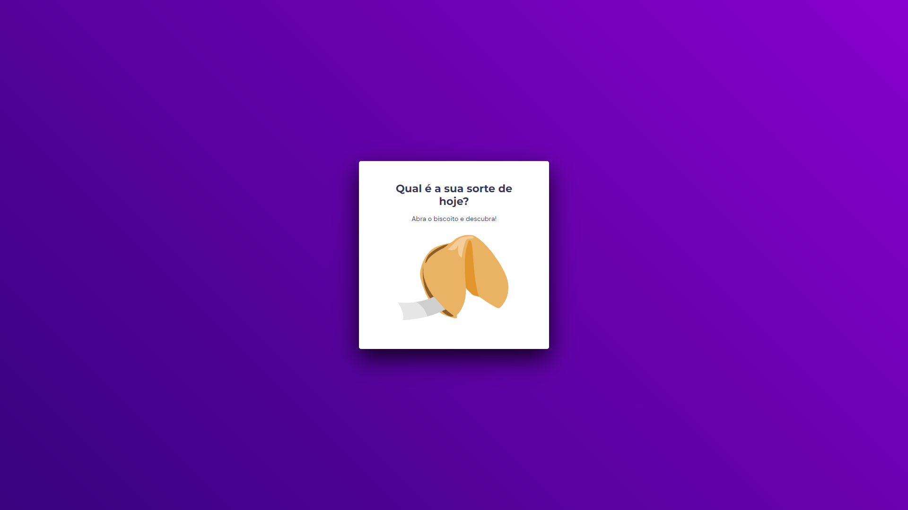

<h1 align="center"> Fortune Cookie </h1>

  <a href="#technologies">Technologies</a>&nbsp;&nbsp;&nbsp;|&nbsp;&nbsp;&nbsp;
  <a href="#project">Project</a>&nbsp;&nbsp;&nbsp;|&nbsp;&nbsp;&nbsp;
  <a href="#layout">Layout</a>&nbsp;&nbsp;&nbsp;|&nbsp;&nbsp;&nbsp;
  <a href="#license">License</a>&nbsp;&nbsp;&nbsp;|&nbsp;&nbsp;&nbsp;
  <a href="#readme-in-portuguese">README in Portuguese</a>&nbsp;&nbsp;&nbsp;|&nbsp;&nbsp;&nbsp;

 

  

 

  

## Technologies

This project was developed with the following technologies:

- HTML
- CSS
- JavaScript
- Git and Github
- Figma

## Project

Developed a fortune cookie page, in which the user can read a random message just with a click.

- To access the finished project, [click here]([https://pcbandeira-m.github.io/fortune-cookie/](https://shimmering-centaur-d6823b.netlify.app)).

## Layout

This project was developted from the following layout: [click here](https://www.figma.com/community/file/1182751789348533739).

## License

This project is licensed under the MIT.

---

by Patricia Melo

`Project created by Rocketseat`

 
 
 

# README in portuguese

 
 

<h1 align="center"> Biscoito da Sorte </h1>

  <a href="#tecnologias">Tecnologias</a>&nbsp;&nbsp;&nbsp;|&nbsp;&nbsp;&nbsp;
  <a href="#projeto">Projeto</a>&nbsp;&nbsp;&nbsp;|&nbsp;&nbsp;&nbsp;
  <a href="#layout">Layout</a>&nbsp;&nbsp;&nbsp;|&nbsp;&nbsp;&nbsp;
  <a href="#licença">Licença</a>&nbsp;&nbsp;&nbsp;|&nbsp;&nbsp;&nbsp;

 

  

 

  

## Tecnologias

Este projeto foi desenvolvido com as seguintes tecnologias:

- HTML
- CSS
- JacaScript
- Git e Github
- Figma

## Projeto

Foi desenvolvido um Biscoito da Sorte, no qual o usuário pode ler uma mensagem aleatório apenas com um clique.

- Para acessar o projeto finalizado, [clique aqui]([https://pcbandeira-m.github.io/fortune-cookie/](https://shimmering-centaur-d6823b.netlify.app)).

## Layout

Este projeto foi desenvolvido a partir do seguinte layout: [click here](https://www.figma.com/community/file/1182751789348533739).

## Licença

Este projeto está sob a licença MIT.

---

by Patricia Melo

`Projeto criado pela Rocketseat`
